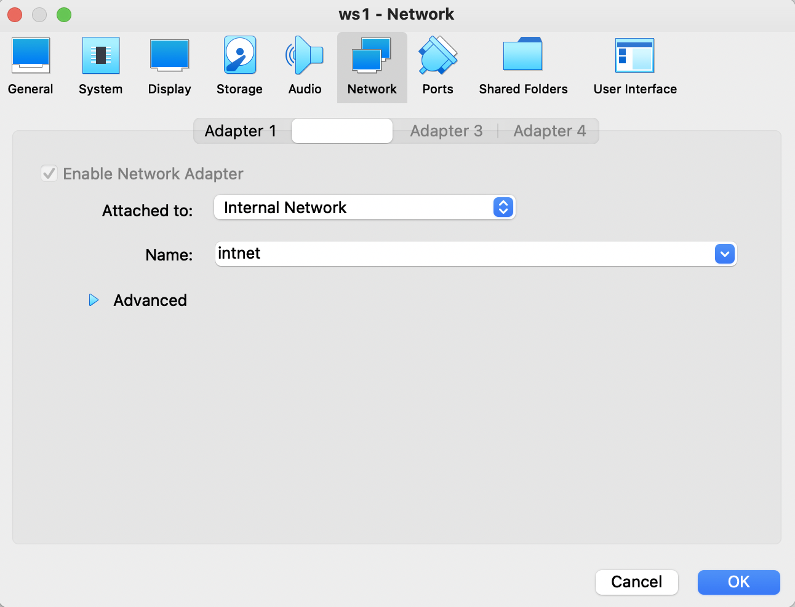
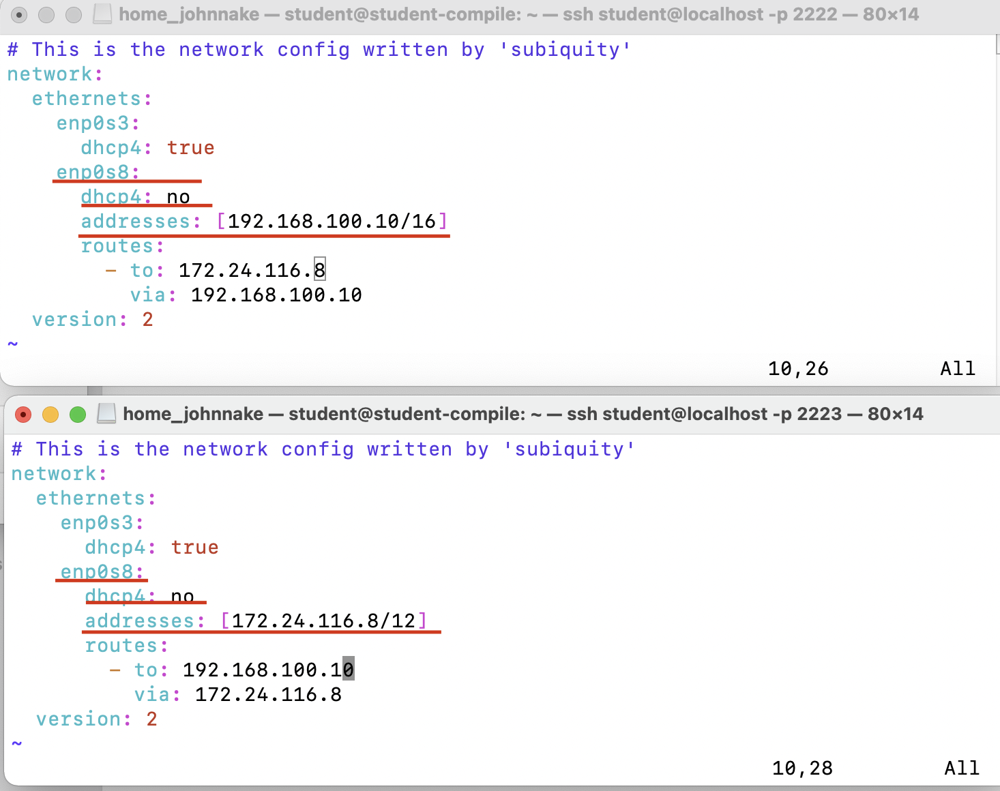
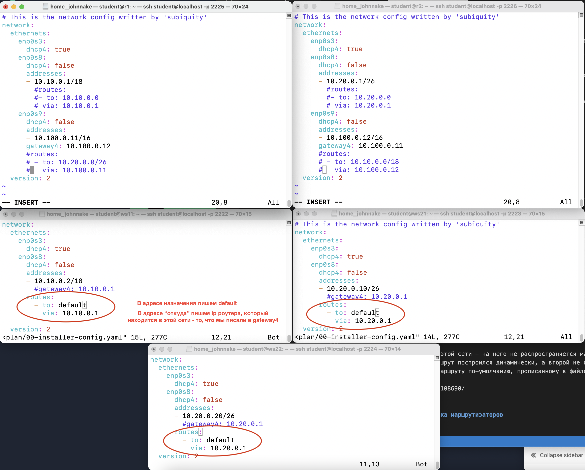
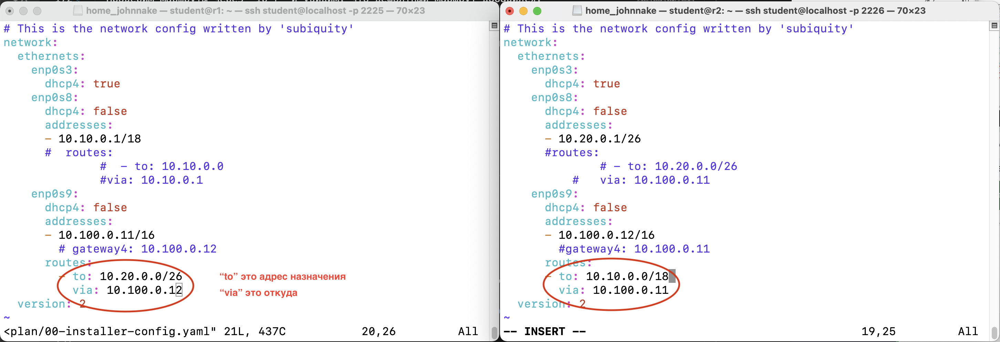
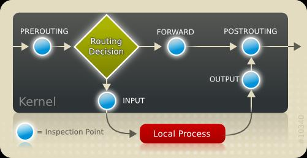

# Сети в Linux

> При старте работы над проектом просим вас постараться хронометрировать время работы над проектом.
> По завершении работы над проектом просим вас ответить на два вопроса [в этом опросе](https://forms.gle/x9fFrF7nTM7LmNLK8)

Настройка сетей в Linux на виртуальных машинах.

## Contents

1. [Инструмент ipcalc](#part-1-инструмент-ipcalc) \
2. [Статическая маршрутизация между двумя машинами](#part-2-статическая-маршрутизация-между-двумя-машинами) \
3. [Утилита iperf3](#part-3-утилита-iperf3) \
4. [Сетевой экран](#part-4-сетевой-экран) \
5. [Статическая маршрутизация сети](#part-5-статическая-маршрутизация-сети) \
6. [Динамическая настройка IP с помощью DHCP](#part-6-динамическая-настройка-ip-с-помощью-dhcp) \
7. [NAT](#part-7-nat) \
8. [Допополнительно. Знакомство с SSH Tunnels](#part-8-дополнительно-знакомство-с-ssh-tunnels)

## Part 1. Инструмент **ipcalc**

#### 1.1. Сети и маски

- Адрес сети 192.160.0.0

- 255.255.255.0; /24; 11111111.11111111.11111111.00000000;

- /15; 255.254.0.0; 11111111.11111110.00000000.00000000;

- 11111111.11111111.11111111.11110000; 255.255.255.240; /28

- Минимальный и максимальный хост в сети 12.167.38.4 при масках: /8, 11111111.11111111.00000000.00000000, 255.255.254.0 и /4.

#### 1.2. localhost

- localhost - "общеизвестное" имя компа для самого себя и ему соответствует IP адрес 127.0.0.1. Это - общепринятая договоренность, которую просто нужно знать. Если говорят "установить сервер на localhost", это означает "установить на тот самый комп, с которого и обращаться к этому серверу".

- Определить и записать в отчёт, можно ли обратиться к приложению, работающему на localhost, со следующими IP: *194.34.23.100* - нет, *127.0.0.2* - да, *127.1.0.1* - нет, *128.0.0.1* - нет.
Обратиться можно только с хостов, которые входят в этот диапазон.

#### 1.3. Диапазоны и сегменты сетей

- какие из перечисленных IP можно использовать в качестве публичного, а какие только в качестве частных: *10.0.0.45* - частный, *134.43.0.2* - публичный, *192.168.4.2* - частный, *172.20.250.4* - публичный, *172.0.2.1* - публичный, *192.172.0.1* - публичный, *172.68.0.2* - публичный, *172.16.255.255* - частный, *10.10.10.10* - частный, *192.169.168.1* - публичный.
Для внутреннего применения были зарезервированы три блока IP-адресов: 10.0.0.0 – 10.255.255.255/8 (16777216 хостов) 172.16.0.0 – 172.31.255.255/12 (1048576 хостов) 192.168.0.0 – 192.168.255.255/16 (65536 хостов).

- какие из перечисленных IP адресов шлюза возможны у сети *10.10.0.0/18*: *10.0.0.1* - нет, *10.10.0.2* - да, *10.10.10.10* - да, *10.10.100.1* - нет, *10.10.1.255* - да.

- Гайды по сетям: 
    - https://www.ibm.com/docs/ru/aix/7.2?topic=management-transmission-control-protocolinternet-protocol

## Part 2. Статическая маршрутизация между двумя машинами

- Для того, что бы виртуальная машина видела новый сетевой интерфейс меняем настройки сети в VirtualBox. Для второй машину ставим следующий по порядку порт.

- Проверим существующие сетевые интерфейсы. Они одинаковые на обоих машинах.

- Добавим новые сетевые интерфейсы: ws1 - *192.168.100.10*, маска */16*, ws2 - *172.24.116.8*, маска */12*. В файле *etc/netplan/00-installer-config допишем новый интерфейс. Потом сохраним настройки 'sudo netplan apply'.

- Проверим сетевые интерфейсы.

#### 2.1. Добавление статического маршрута вручную

- Пропишем статический маршрут командой 'ip r add'. Потом сохраним настройки 'sudo netplan apply'.

- Пропингуем машины с обеих сторон.

#### 2.2. Добавление статического маршрута с сохранением

- Сначала ребутнем обе машины. Затем на обеих машинах в файле *etc/netplan/00-installer-config* допишем роутер. Сохраним настройки 'sudo netplan apply'. https://sysadminium.ru/adm_serv_linux-network_setup_on_ubuntu/

- Снова пропингуем машины.

## Part 3. Утилита **iperf3**

#### 3.1. Скорость соединения

- 8 бит == 1 байт.

- 8 Mbps == 1 MB/s.

- 100 MB/s == 819 200 Kbps.

- 1 Gbps == 1024 Mbps

#### 3.2. Утилита **iperf3**

- Хороший гайд про 'iperf3' https://losst.ru/kak-polzovatsya-iperf

- Установим 'iperf3' и проверим скорость соединения. На одной машине запускаем сервер, а со второй машины слушаем.

## Part 4. Сетевой экран

- Полезные статьи
  - https://selectel.ru/blog/setup-iptables-linux/
  - https://1cloud.ru/help/linux/nastrojka_linus-firewall_iptables
  - https://timeweb.com/ru/community/articles/nastroyka-iptables-dlya-chaynikov
  - https://linux-notes.org/razreshit-zablokirovat-ping-icmp-pakety-v-unix-linux/

- Сначала посмотрим существующие сетевые интерфейсы.

- Настройка файла */etc/firewall.sh*, имитирующий фаерволл, на ws1 и ws2

- Сделаем файл исполняемым.

- Теперь запустим этот файл и пинганем обе машины.

- Видим, что первая машина может пинговать вторую, а вторая первую не может.
  - Дело в том, что на второй машине сначала написано разрешающее правило, а потом запрещающее. Поэтому когда мы пытаемся пинговать ее, то фаервол встречает первое правило, под которое попадает запрос, и через следующие правила этот запрос он не фильтрует - эти правила отбрасываются. Поэтому вторая машина пингуется.
  - На первой машине сначала написано запрещающее правило, а потом разрешающее. Поэтому когда приходит запрос на пинг, то он натыкается на DROP и остальные правил также отбрасываются - пинг не проходит.

#### 4.2. Утилита **nmap**

- У нас не пингуется первая машина, поэтому со второй машины запустим nmap. https://losst.ru/kak-polzovatsya-nmap-dlya-skanirovaniya-seti

> Вывод команды показывает, что этот хост доступен.

## Part 5. Статическая маршрутизация сети

- Поднимаем 5 виртуальных машин и не забываем в настройках сети включить адаптер внутренней сети (для роутеров по 2 адаптера, потому что у них 2 сети, а для рабочих станций по одному адаптеру) и изменить порты у каждой машины, чтобы они не пересекались.

#### 5.1. Настройка адресов машин

- Настраиваем  файлы конфигурации на каждой машине. Статья на эту тему https://tokmakov.msk.ru/blog/item/481.

- Настраиваем VirtualBox под нашу сеть. Главное не запутаться и правильно настроить адаптеры в VirtualBox - прописать в них названия сетей по прилагаемой схеме.

- Подтверждаем изменения на машинах 'sudo netplan apply' и проверим сетевые интерфейсы 'ip -4 a'.

- Пингуем ws22 с ws21, затем r1 с ws11.

#### 5.2. Включение переадресации IP-адресов.

- Запускаем команду sysctl -w net.ipv4.ip_forward=1. *При таком подходе переадресация не будет работать после перезагрузки системы.* Здесь справка по ней: https://adminunix.ru/nastrojka-sysctl/ и https://900913.ru/tldr/linux/ru/sysctl/.

- Откроем файл */etc/sysctl.conf* и раскомментируем в нем следующую строку:
`net.ipv4.ip_forward = 1`. *При использовании этого подхода, IP-переадресация включена на постоянной основе.*

#### 5.3. Установка маршрута по-умолчанию

- Для добавления маршрута по умолчанию в файл *etc/netplan/00-installer-config* допишем новые настройки, можно это сделать статически, а можно динамически.

- В связи с тем, что gateway4 на рабочих машинах - устаревший стиль задания динамического маршрута, есть еще один способ - писать через default:

- Проверим маршруты через 'ip r' и увидим, что дефолтный маршрут добавился:

- Пропингуем с ws11 роутер r2 и покажем на r2, что пинг доходит. Используем команду:
`tcpdump -tn -i enp0s8 -c 5`

https://losst.ru/kak-polzovatsya-tcpdump
https://wiki.merionet.ru/servernye-resheniya/42/zaxvat-paketov-s-tcpdump-rukovodstvo-s-primerami

#### 5.4. Добавление статических маршрутов

- Добавим в роутеры r1 и r2 статические маршруты в файле конфигураций:

- Проверим командой 'ip r' на роутерах какие маршруты в таблице маршрутизации:

- Запустим команды `ip r list 10.10.0.0/18` и `ip r list 0.0.0.0/0`

Мы видим, что трафик на подсеть 10.10.0.0/18 уходит через интерфейс enp0s8. proto kernel означает, что роутинг был задан ядром автоматически при задании IP интерфейса. scope link означает, что эта запись является действительной только для этого интерфейса (enp0s8). src 10.10.0.2 задает IP-адрес отправителя для пакетов, попадающих под это правило роутинга. Трафик на любые другие хосты, не попадающие в подсеть 10.10.0.0/18 будет уходить на шлюз 10.10.0.1 через интерфейс enp0s8 (default via 10.10.0.0/18 dev enp0s8).

Первый адрес относится к этой сети - на него не распространяется маршрут по-умолчанию, поэтому маршрут построился динамически, а второй не относится к этой сети и он пошел по маршруту по-умолчанию, прописанному в файле конфигурации.
https://habr.com/ru/post/108690/

#### 5.5. Построение списка маршрутизаторов

- Команда 'traceroute' позволяет поэтапно пробросить пакеты по всему маршруту следования от источника до места назначения.

Каждый пакет проходит на своем пути определенное количество узлов, пока достигнет своей цели. Причем, каждый пакет имеет свое время жизни. Это количество узлов, которые может пройти пакет перед тем, как он будет уничтожен. Этот параметр записывается в заголовке 'TTL', каждый маршрутизатор, через который будет проходить пакет уменьшает его на единицу. При 'TTL=0' пакет уничтожается, а отправителю отсылается сообщение 'Time Exceeded'.

Команда 'traceroute' linux использует 'UDP' пакеты. Она отправляет пакет с 'TTL=1' и смотрит адрес ответившего узла, дальше 'TTL=2', 'TTL=3' и так пока не достигнет цели. Каждый раз отправляется по три пакета и для каждого из них измеряется время прохождения. Пакет отправляется на случайный порт, который, скорее всего, не занят. Когда утилита 'traceroute' получает сообщение от целевого узла о том, что порт недоступен трассировка считается завершенной.
https://losst.ru/komanda-traceroute-linux
https://habr.com/ru/company/alexhost/blog/531170/
https://andreyex.ru/linux/komanda-tcpdump-v-linux/

- Команда 'tcpdump' показывает какие пакеты проходят через эту сеть - enp0s9 -  протокол udp - указывает 'ttl' пакетов, адреса источника и назначения и другую информацию о проходящих пакетах.

- Вывод 'traceroute' показывает, какие роутеры у нас на пути: 10.10.0.1 и 10.100.0.12. Последний - третий - адрес - это адрес назначения пакета.

#### 5.6. Использование протокола **ICMP** при маршрутизации

- Так как команда 'ping' работает через протокол 'icmp', запустим 'tcpdump' и видим, что по несуществующему 'ip' адресу отправляется запрос, а ответ не приходит. 'Ping' показывает '100% packet loss'.

## Part 6. Динамическая настройка IP с помощью **DHCP**

- Статья про настройку DHCP https://logi.cc/kaketo-nastrojka-dhcp-servera-na-linux/#.YzV5AdZBy1t
https://sysadmin-note.ru/article/ustanovka-i-nastrojka-dhcp-servera-v-ubuntu/

- Сначала установим DHCP сервер 'isc-dhcp-server'.

- Теперь настроим его. Откроем файл '/etc/dhcp/dhcpd.conf' и пропишем настройки, указанные в задании.

- Потом в файле '/etc/default/isc-dhcp-server' добавим нашу сеть, в которой необходимо выдавать адреса.

- После выполнения этой команды заметим, что начала вываливаться ошибка о том, что не может найти имя хоста:

- Устраним ее: в файле '/etc/hosts' исправим 'student-compile' на 'r2'. Это нам пригодится при работе далее.

- В файле '/etc/resolv.conf' пропишем 'nameserver'. DNS-сервер (Name-сервер, nameserver, NS) — сервер, преобразующий доменные имена, с которыми работают пользователи, в понятные компьютерам IP-адреса или в обратном направлении.

- После этого можно перезагрузить DHCP сервер.

- Теперь на 'ws21' в файле '/etc/netplan/00-installer-config.yaml' включим службу 'dhcp' и закомментируем статический адрес. После этого применим настройки - 'sudo netplan apply' - и ребутнем машину.

- Запросим список доступных сетевых интерфейсов. Так было до:

> Так было до...

- Так стало после.

> ...так стало после настройки DHCP сервера и файла '00-installer-config.yaml'. Как видим в строке 'inet' добавилось слово 'dynamic'.

- Теперь пропингуем 'ws22' с 'ws21' и обратно.

> Все работает

- Теперь настроим 'r1' и реализуем выдачу адресов с жесткой привязкой к MAC-адресу (ws11) - после этого перезапустим DHCP сервер. У ws11 укажем MAC адрес, для этого в etc/netplan/00-installer-config.yaml надо добавить строку: macaddress: 10:10:10:10:10:BA. Разумеется включаем службу 'dhcp' и закомментируем статический адрес. Все как делали выше. И применим настройки конфигурации.

 - Также надо прописать мас-адрес в настройках VirtualBox.

- Теперь проверим наши сетевые интерфейсы.

- Пинганем машины, чтобы удостовериться, что все в порядке.

## Part 7. **NAT**

- Хорошие материалы по NAT, SNAT и DNAT.
https://russianblogs.com/article/61951615822/
https://ixnfo.com/nastroyka-maskaradinga-v-ubuntu.html
https://nebegun.ru/index.php/young/ubuntu/2748-shlyuz-na-baze-ubuntu-20-04-server
https://www.youtube.com/watch?v=xlmGCmZswdw&t=41s

- Но сначала устанавливаем Apache2 на ws22 и r1.
https://help.ubuntu.ru/wiki/apache2

- Сначала вернем статическое присвоение ip-адресов в настройках. 

- Установим 'apache2' на 'r1' и 'ws22' (предварительно отключив маршруты в конфигурации, чтобы заработал интернет на 'ws22').

- В файле */etc/apache2/ports.conf* на ws22 и r1 изменить строку `Listen 80` на `Listen 0.0.0.0:80`, то есть сделать сервер Apache2 общедоступным.

- Запустим службу 'apache2' на ws22 и r1.

- Создадим файл '/etc/firewall.sh' на 'r1' и впишем туда начальные настройки по заданию.

- Сделаем файл исполняемым и запустим его.

- Мы запретили перенаправление всех пакетов, поэтому пинг не проходит.

- Разрешим отдельно для протокола 'icmp' и цепочек 'INPUT', 'OUTPUT' и 'FORWARD' - для всех типов пакетов.

- Проверим, что пинг начал проходить.

- Рассмотрим детально как работают SNAT и DNAT - посмотрим на цепочку, через которую проходит пакет данных в iptables.

> Ромбовидная область на рисунке - это место, где пакет данных оценивается и пересылается. Здесь система распределит пакет данных в соответствии с IP-адресом в IP-адресе назначения в IP-пакете данных. Если IP-адрес назначения является локальным адресом, данные будут переданы в цепочку INPUT. Если это не локальный адрес, он будет передан цепочке FORWARD для обнаружения.
Это означает, что DNAT, который мы собираемся выполнить, должен быть выполнен в цепочке PREROUTING перед входом в эту ромбовидную область пересылки. Например, мы хотим перенаправить доступ к 202.103.96.112 на 192.168.0.112:
___'iptables -t nat -A PREROUTING -d 202.103.96.112 -j DNAT --to-destination 192.168.0.112'___
Фактически, в этом процессе преобразования IP-адрес назначения в пакете данных, который достиг шлюза Linux (межсетевого экрана), изменяется с 202.103.96.112 на 192.168.0.112, а затем передается в систему маршрутизации для пересылки. И SNAT, естественно, должен работать в последней цепочке, прежде чем пакет данных выйдет из этого компьютера, то есть в цепочке POSTROUTING.
___'iptables -t nat -A POSTROUTING -s 192.168.0.0/24 -j SNAT --to-source 58.20.51.66'___
Этот оператор указывает системе изменить исходный IP-адрес данных, которые будут выводиться из машины, на 58.20.51.66. Таким образом, после того, как пакет данных достигнет целевой машины, конечная машина вернет пакет на 58.20.51.66, который является локальным компьютером. Если вы не выполните эту операцию, ответный пакет обязательно будет потерян во время передачи вашего пакета данных.

- Включим **SNAT**, а именно маскирование всех локальных ip из локальной сети, находящейся за r2.

>  на картинке подробно описано, что и за что отвечает - по сути мы все транзитные пакеты с адресами из локальной сети меняем на адрес 10.100.0.12.

- Проверим замену адреса источника пакета через пинг 'ws11' с 'ws22' и просмотр 'tcpdump' на 'r1'.

> Видим, что адрес источника пакета 10.20.0.20 поменялся на 10.100.0.12.

- Включим **DNAT** на 8080 порт машины r2 - то есть, при подключении из сети enp0s9 на порт 8080 машины r2 нас перекидывало на веб-сервер Apache, запущенный на порту 80 машины ws22.

> добавим запись в таблицу nat, в цепочку PREROUTING: если пакет будет из сети enp0s9 по протоколу tcp и придет на порт 8080, то делать DNAT и адрес назначения менять на 10.20.0.20 порт 80 - на котором работает веб-сервер Apache2 - как мы выше прописали в файле */etc/apache2/ports.conf* на ws22 и r1.

- Проверим соединение по TCP для SNAT, для этого с ws22 подключимся к серверу Apache на r1 командой telnet [адрес] [порт].

- Проверим соединение по TCP для DNAT, для этого с r1 подключимся к серверу Apache на ws22 командой telnet (обратимся по адресу r2 и порту 8080).

## Part 8. Дополнительно. Знакомство с **SSH Tunnels**

- Материал по теме: https://habr.com/ru/post/331348/

- Изменим порт для апача на локалхост.

- *Local TCP forwarding* с ws21 до ws22. Теперь пробросим тоннель с 21 машины на 22 машину. Указываем порт, который будет слушать на этой машине, локалхост и порт 80 - это относится к машине, к которой подключаемся и где стоит апач. Последний - это локальный айпишник машины к которой подключаемся. В результате одна машина будет слушать по порту 9999 локалхоста, а вторая по порту 80 локалхоста.

- Проверка соединения: на 21 машине мы можем телнетом послушать порт 9999: после запуска прервем ввод 'cntr+D' и 'Enter'. Информация на экране.

- Но по-правильному надо слушать на той машине, на которую мы пробросили туннель - с 22 машины, по порту 80.

- *Remote TCP forwarding* c ws11 до ws22. Теперь пробросим удаленный тоннель с 11 машины на 22. Для этого запустим на 22 машины команду: 

- Проверка соединения на обеих машинах - главное не запутаться с портами.

- Еще одна фишка, как можно проверить наличие соединения через проброс портов - можно открыть стартовую страницу апач на Маке.

__!!!THE END!!!__